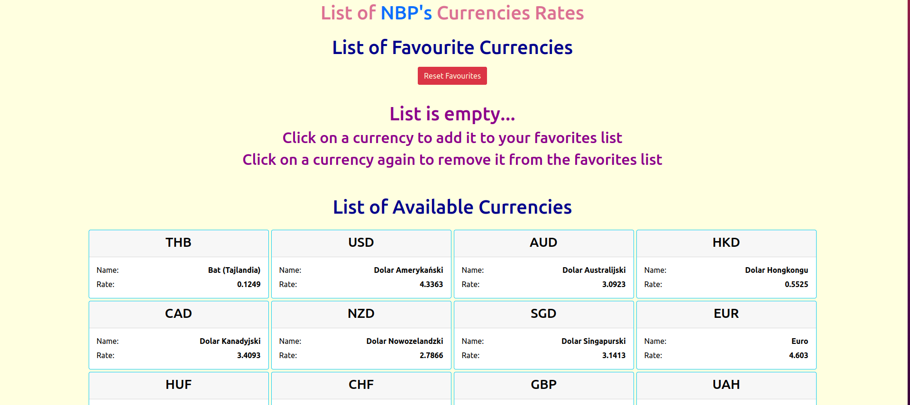

# NBP_api

A small application that uses the NBP API.

## ScreenShots

## Preparation

To install dependencies, run the following command:

### `npm i`

To start the app in the development mode, run the following command:

### `npm start`

Then, open [http://localhost:3000](http://localhost:3000) to view it in the browser.

## Description

Click on the list of available currencies (background: gray) to add to your favorites. Click on the selected currency
(background: blue) to remove it from your favorites. To reset your favorite currencies, click the red button and confirm in
the popup window.

The application is built with React, Redux, Typescript, and React-Bootstrap.

## Other

github Dependabot alert:
[click here](https://stackoverflow.com/questions/71282206/github-dependabot-alert-inefficient-regular-expression-complexity-in-nth-check)
